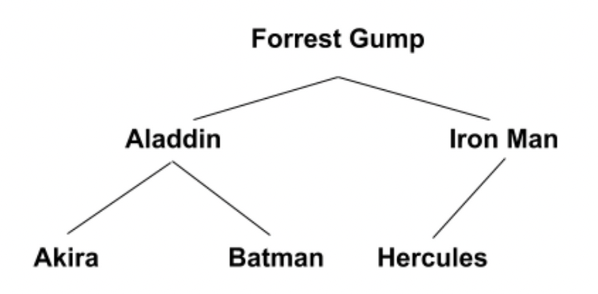

# CSCI 2270 – Data Structures - Assignment 6: Binary Search Tree

## Objectives

1. Build a binary search tree (BST)
2. Traversal, Search and Deletion in a BST

## Instructions

Please read all the directions ​*before* writing code, as this write-up contains specific requirements for how the code should be written.

To receive credit for your code, you will need to pass the necessary test cases. Use the following steps to test your code as you work on the assignment:

 1. Open up your Linux terminal, navigate to the build directory of this assignment (e.g. `cd build`).
 2. Run the `cmake ..` command.
 3. Run the `make` command.
 4. If there are no compilation errors, two executables will be generated within the build directory: `run_app_1` and `run_tests`.
 4. If you would like to run your program, execute `run_app_1` from the terminal by typing `./run_app_1 <Required argument>`.
 5. To run the grading tests, execute `run_tests` from the terminal by typing `./run_tests`.


## Overview

In 2009, Netflix held a competition to see who could best predict user ratings for films based on previous ratings without any other information about the users or films. The grand prize of US$1,000,000 was given to the BellKor's Pragmatic Chaos team which bested Netflix's own algorithm for predicting ratings by 10.06%. This kind of data science is facilitated with the application of good data structures. In fact, cleaning and arranging data in a conducive manner is half the battle in making successful predictions.

Imagine you are attempting to predict user ratings given a dataset of IMDB’s top 100 movies. Building a binary search tree (BST) will enable you to search for movies and extract their features very efficiently. The movies will be accessed by their titles, but they will also store the following features:

+ IMDB ranking (1-100)
+ Title
+ Year released
+ IMDB average rating

Your binary search tree will utilize the following node struct:

```
struct MovieNode {
    int ranking;
    string title;
    int year;
    float rating;
    MovieNode* left = NULL;
    MovieNode* right = NULL;
};
```


### *MovieTree* Class Specifications

Your code should implement a binary search tree (BST) of `MovieNode` data type. A header file that lays out this tree can be found in `MovieTree.hpp`. As usual, DO NOT modify the header file. *You may implement helper functions in your .cpp file to facilitate recursion if you want as long as you don’t add those functions to the MovieTree class.*

**NOTE: The test cases will be testing for memory leaks so take care of them to get full grades.**

Fill in the file `MovieTree.cpp` according to the following specifications.

**MovieTree()**
+ Constructor: Sets **root** data member to NULL.

**~MovieTree()**
+ Destructor: Free all memory that was allocated and set root to NULL.

**void printMovieInventory()**
+ Print every node in the tree in alphabetical order of titles using the following format:

```
cout << "Movie: " << m->title << " (" << m->rating << ")" << endl;
```

If there is no movie entry in the tree, print the following message instead:

```
cout << "Tree is Empty. Cannot print." << endl;
```

**void addMovieNode(int ranking, string title, int year, float rating)**
+ Add a node to the BST in the correct place based on its `title`. Every node’s left children should come before it alphabetically, and every node’s right children should come after it alphabetically. 

 *Hint: you can compare strings with `<`, `>`, `==`, `string::compare()` function.*

+ For example, if the root node of the tree is the movie “Forrest Gump”, then the movie “Iron Man” should be in the root's right subtree and “Aladdin” should be in its left subtree.

+ You can assume that no two movies have the same title.

**void findMovie(string title)**
+ Find the movie with the given title, then print out its information:

```
cout << "Movie Info:" << endl;
cout << "==================" << endl;
cout << "Ranking:" << node->ranking << endl;
cout << "Title :" << node->title << endl;
cout << "Year :" << node->year << endl;
cout << "Rating :" << node->rating << endl;
```

If the movie isn’t found, print the following message instead:

```
cout << "Movie not found." << endl;
```

**void queryMovies(float rating, int year)**
+ Print all the movies whose rating is at least as good as the input parameter `rating` and that are newer than `year` in the *preorder* fashion using the following format:

```
cout << "Movies that came out after " << year << " with rating at
least " << rating << ":" << endl;
// each movie that satisfies the constraints should be printed with
cout << m->title << " (" << m->year << ") " << m->rating << endl;
```

If there is no movie entry in the tree, print the following message instead:

```
cout << "Tree is Empty. Cannot query Movies." << endl;
```

**void averageRating()**
+ Print the average rating for all movies in the tree. Use the following format:

```
cout << "Average rating:" << average << endl;
```

If there is no movie entry in the tree, print the following message instead:

```
cout << "Average rating:0.0" << endl;
```

**void printLevelNodes(int level)**
+ Print all the nodes in the tree from left to right that are exactly at `depth = level` from the root of the tree. If the user passes a `level` value which is more than the maximum depth of the tree, then don't print anything and just exit the function.

```
cout << "Movie: " << m->title << " (" << m->rating << ")" << endl;
```

For example, for the tree below, if `level` = 2, your function should print the title and rating for Akira, Batman and Hercules in that order (nodes from left to right at depth=2 from the root node of the tree).




### Order of function implementation

1. Destructor and Constructor
2. addMovieNode and printMovieInventory
3. findMovie
4. queryMovies
5. averageRating
6. printLevelNodes


### Main driver file [Main driver is provided in starter code]

***NOTE: Main driver file is provided in starter code. You do not have to code it. We will walk through a brief introduction of the driver here***

The main function will read information about each movie from a CSV file and store that information in a `MovieTree` using your `addMovieNode()` function implementation.

The name of the CSV file with this information should be passed in as a command-line argument. Example files `Movies.csv`, `Documentaries.csv` are added in the repository for your use in the format:

```
<Movie 1 ranking>,<Movie 1 title>,<Movie 1 year>,<Movie 1 rating>
<Movie 2 ranking>,<Movie 2 title>,<Movie 2 year>,<Movie 2 rating>
Etc...
```

After reading the information on each movie from the file and building the tree, the user is
displayed the following menu:

```
======Main Menu======
1. Find a movie
2. Query movies
3. Print the inventory
4. Average Rating of movies
5. Print movies at Level k
6. Quit
```

The menu options have the following behavior:

**1. Find a movie:**
+ Calls your tree’s `findMovie` function on a movie specified by the user.
 The user is prompted for a movie title.

**2. Query movies:**
+ Calls your tree’s `queryMovies` function on a rating and year specified by the user. Prompts the user for a rating and year.

**3. Print the inventory:**
+ Call your tree’s `printMovieInventory` function

**4. Average Rating of movies:**
+ Calls your tree’s `averageRating` function

**5. Print movies at Level k:**
+ Calls your tree’s `printLevelNodes` function on the level specified by the user. The user is prompted for a level.

**6. Quit:**
+ Program exits after printing a friendly message to the user.
