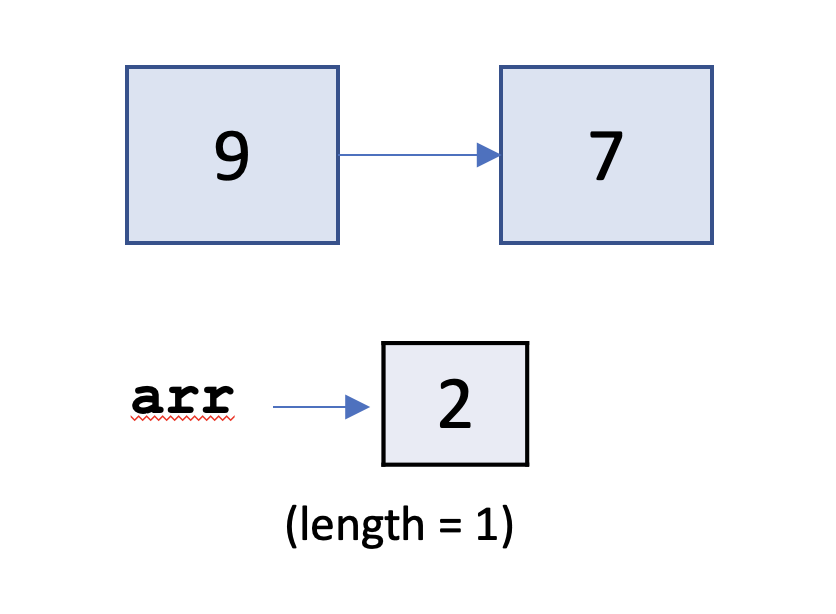

# CSCI 2270 – Midterm 1, Part II: Section 100

You are given a singly linked list class with `int` type keys. Your task is to implement a member function that traverses the linked list, copies all the even numbered keys into a dynamically allocated array, and deletes all of the nodes containing even numbered keys.  
 
## Starer Code and Submission:
You must complete the following function:

`void SLL::moveEvenToArray(int* &arr, int &length){...}` (35 points)

The starter code is included in the `code_1` directory. You are only allowed to make changes to the `moveEvenToArray` function in `LinkedList.cpp`. Do not change `LinkedList.hpp`. You can do whatever you want in `app_1/main_1.cpp`, but it will not affect your grade. 

Note that you are not guaranteed to receive full points just by passing the given test
cases. Your algorithm also has to be correct and not introduce any memory leaks.

## Specifications for `moveEvenToArray`:

* Take in two parameters:
1. `arr` which is to point to the resulting array,
2.`length` which needs to be updated to contain the resulting length of the array. 
* Figure out the number of nodes containing even key values.
* Declare a dynamic array of length **exactly** equal to the number of even key values in the linked list.
* Copy all the *even* key values from the linked list into the dynamic array. The keys in the array need to appear in the same order as in the linked list.
* Delete all of the linked list nodes containing even key values.

**Note**: The array `arr` gets passed into the `moveEvenToArray` function. `arr` is NOT a member of the `SLL` class.


## Examples 
### Example A
Let `li` be an object of the `LinkedList` class, and `arr` be an `int` type pointer. If `li` and `arr` have the following initial configuration:


After a call to `moveEvenToArray(arr, length)`, the configuration should look as follows:



### Example B
Let `li` be an object of the `LinkedList` class, and `arr` be an `int` type pointer. If `li` and `arr` have the following initial configuration:


After a call to `moveEvenToArray(arr, length)`, the configuration should look as follows:


### Example C
Let `li` be an object of the `LinkedList` class, and `arr` be an `int` type pointer. If `li` and `arr` have the following initial configuration:


After a call to `moveEvenToArray(arr, length)`, the configuration should look as follows:


## Getting and submitting code

 1. Open up your Linux terminal, navigate to the build directory of this assignment (e.g. `cd build`).
 2. Run the `cmake ..` command.
 3. Run the `make` command.
 4. If there are no compilation errors, two executables will be generated within the build directory: `run_app_1` and `run_tests`.
 5. If you would like to run your program including your app implementation in the `main` function, execute `run_app_1` from the terminal by typing `./run_app_1`. It is not required that you complete anything in `main` for the submission. 
 6. To run the grading tests, execute `run_tests` from the terminal by typing `./run_tests`. 
 7. Your submission will be the code you commit and push by the exam end time. (Note: you do NOT need to paste your link back into Canvas.) 
 
### Reminder - this is how you submit in GitHub:
 * Stage:
     ```console
     $ git add ../code_1/LinkedList.cpp
     ```
 
 * Commit the changes to our local repository:
     ```console
     $ git commit -m 'this is my commit'
     ```
 
* Push to GitHub: 
     ```console
     $ git push
    ```
